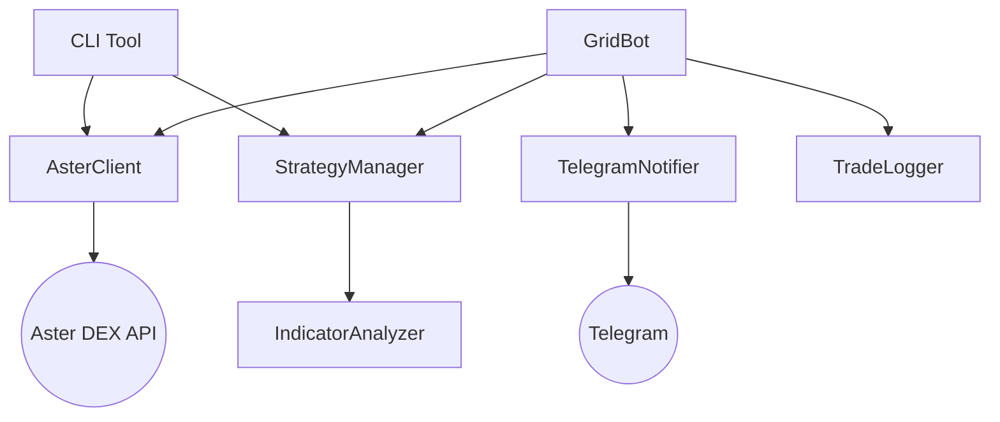

# Aster DEX Grid Trading Bot

## Project Overview

**Aster DEX Grid Trading Bot** is an automated trading solution designed for the Aster DEX futures market. It implements an arithmetic grid trading strategy with advanced risk management, smart take-profit mechanisms, and dynamic re-grid capabilities. The bot is optimized for "harvesting" airdrop points while maintaining a balanced risk profile.

**Key Features:**
- **Grid Strategy:** Arithmetic grid with dynamic spacing based on ATR (Volatility).
- **Smart Take-Profit:** Adapts TP% based on RSI and MACD indicators.
- **Risk Management:** 12-layer protection including circuit breakers, drawdown management, and daily loss limits.
- **Analysis:** Real-time trend analysis (EMA, MACD, RSI, Volume) and BTC correlation checks.
- **Deployment:** Optimized for Railway.app.

## Tech Stack

- **Language:** Python 3.11+
- **Core Libraries:** `aiohttp` (Async HTTP), `websockets` (Real-time data), `pandas` (Data manipulation), `ta` (Technical analysis).
- **Database:** SQLite (`grid_bot_trades.db`) for trade history and state persistence.
- **Interface:** CLI for management, Telegram for notifications.

## Architecture

The system is modular, centering around `GridBot` which orchestrates trading logic.



### Key Components

| Component | File | Description |
|-----------|------|-------------|
| **GridBot** | `grid_bot.py` | Core execution loop. Manages grid levels, order placement, and rebalancing. |
| **AsterClient** | `aster_client.py` | Async wrapper for Aster DEX REST and WebSocket APIs. Handles authentication and signing. |
| **StrategyManager** | `strategy_manager.py` | Analyzes market conditions (trends, volatility, funding rates) and manages risk. |
| **IndicatorAnalyzer** | `indicator_analyzer.py` | Calculates technical indicators (RSI, MACD, EMA, ATR). |
| **CLI** | `cli.py` | Command-line interface for user interaction and manual control. |
| **Config** | `config.py` | Centralized configuration using Dataclasses. Validates settings. |
| **TradeLogger** | `trade_logger.py` | SQLite database handler for recording trades and performance metrics. |

## Setup & Configuration

1.  **Environment Variables:**
    Copy `.env.example` to `.env` and configure:
    ```bash
    ASTER_API_KEY=your_api_key
    ASTER_API_SECRET=your_api_secret
    TELEGRAM_BOT_TOKEN=your_bot_token
    TELEGRAM_CHAT_ID=your_chat_id
    DRY_RUN=false
    ```

2.  **Configuration (`config.py`):**
    Settings are grouped into classes: `TradingConfig`, `GridConfig`, `RiskConfig`.
    - **Symbol:** `SOLUSDT` (Default)
    - **Leverage:** 5x (Moderate risk)
    - **Grid:** 12 levels, ±3% range (Dynamic based on ATR).
    - **Risk:** Max Drawdown 20%, Daily Loss Limit 10%.

## CLI Usage

The project provides a rich CLI for managing the bot and analyzing the market.

**Basic Commands:**
- `python cli.py run` - Start the trading bot.
- `python cli.py balance` - Show account balance.
- `python cli.py status` - Show bot status (if running).
- `python cli.py price [symbol]` - Get current price.

**Trading & Analysis:**
- `python cli.py analyze [symbol]` - Run technical analysis (Trend, ATR, Volatility).
- `python cli.py orders [symbol]` - List open orders.
- `python cli.py positions` - List open positions.
- `python cli.py close [symbol]` - Emergency close position.
- `python cli.py order [symbol] [side] [qty]` - Place manual order.

**Statistics:**
- `python cli.py stats [days]` - Show win rate, PnL, profit factor.
- `python cli.py daily [days]` - Daily PnL breakdown.
- `python cli.py levels` - Performance per grid level.
- `python cli.py history` - Recent trade history from exchange.

## Strategy Details

### 1. Grid Execution
- **Initialization:** Calculates grid levels based on current price and `GRID_RANGE_PERCENT`.
- **Orders:** Places `BUY LIMIT` below price and `SELL LIMIT` above price.
- **Rebalancing:**
    - If `BUY` fills: Place `SELL` (TP) one level higher.
    - If `SELL` fills: Place `BUY` (Re-entry) one level lower.

### 2. Risk Management (The "12 Layers")
The bot includes a sophisticated risk engine:
1.  **Circuit Breaker:** Stops if Max Drawdown > 20%.
2.  **Position Limits:** Max 5 positions, Max 80% balance usage.
3.  **Volatility Guard:** Pauses if ATR indicates extreme volatility (>10%).
4.  **Auto Re-Grid:** Resets grid if price drifts > 3.5% from center.
5.  **Trend Protection:** Auto-switches side (Long/Short) based on Trend Score (±2).
6.  **Price Spike:** Detects sudden moves (>3% in 5m) via WebSocket.
7.  **Funding Rate:** Monitors for high funding costs.
8.  **BTC Correlation:** Checks BTC trend to prevent fighting the market.
9.  **Liquidity:** Monitors order book depth and spread.
10. **Exposure:** Alerts if position size mismatch occurs.
11. **Intelligent Drawdown:**
    - 15% Drawdown: Pause new BUYs.
    - 20% Drawdown: Cut 30% of position.
    - 25% Drawdown: Full cut loss.
12. **Switch Protection:** Blocks side switching if holding a position to prevent realized losses.

### 3. Harvest Mode
Designed for airdrop farming:
- Can prioritize **Market Orders** (Taker) over Limit orders to generate 2x points.
- Configurable via `HARVEST_MODE` in `config.py`.

## Development Guidelines

- **Code Style:** Follow PEP 8. Use type hints.
- **Async:** The entire core is asynchronous. Use `async/await` patterns.
- **Logging:** Use the `logging` module. Logs are written to stdout and `logs/grid_bot.log`.
- **Testing:** Run tests using `pytest`:
  ```bash
  pytest tests/
  ```

## Deployment (Railway)

- The project is configured for Railway.app.
- **Build Command:** (None/Default)
- **Start Command:** `python cli.py run`
- **Volumes:** `/app/logs` should be mounted to persist logs.
- **Database:** `grid_bot_trades.db` is local SQLite (ensure persistence if needed, or switch to Postgres).

## Analyst Log & Session Memory

### 📅 Session Snapshot: Monday, January 19, 2026

**1. Market Condition (SOLUSDT)**
- **Price (Bot):** ~$133.51 (Aster DEX)
- **Price (External):** ~$142 - $144 (Global Avg)
- **Trend State:** 🟡 NEUTRAL / Consolidation
- **Volatility:** Moderate
- **Technical Context:**
    - External analysis suggests support at ~$134-$137 (EMAs) and resistance at $145-$147.
    - The bot's price ($133.51) is testing the support zone mentioned in external reports.
- **Analyst Note:** Significant divergence between global average price and DEX price (or potential volatility). Institutional inflows (ETFs) and stablecoin growth on Solana remain strong fundamental drivers.

**2. System Health & Performance**
- *Status Check Needed:* Run `python cli.py status` to verify active positions.
- **Configuration Verification:**
    - Ensure `TradingConfig` aligns with the current price level ($133.51).
    - Grid range should be checked to ensure current price is within bounds.

**3. Strategic Recommendations**
- **Immediate Action:** **MONITOR**. Price is testing support levels.
- **Risk Monitor:** Watch for a bounce from $134 level or a break lower. Divergence in price sources should be investigated if it persists (could be an arb opportunity or data issue).
- **Maintenance:** Verify bot connectivity and price feed accuracy given the deviation from global averages.

### 🌐 External Market Intelligence (Web Search)
*As of Jan 19, 2026*

**1. Sentiment & News**
- **Market Sentiment:** Cautiously Bullish / Neutral.
- **Key Drivers:**
    - **Institutional Interest:** SOL ETFs seeing consistent inflows ($1.2B assets).
    - **Ecosystem:** Stablecoin market cap at ATH ($15B+); Memecoins driving DEX volume.
    - **Price Action:** Recent rejection from $147 resistance; currently consolidating.
- **Macro Context:** US regulatory environment improving; Bitcoin consolidating near highs.

**2. Synthesis with Internal Data**
- **Alignment:** Bot price of $133.51 aligns with the "support at 20-day EMA (~$134)" noted in technical analysis. This suggests the price has retraced to a key support level.
- **Conclusion:** If support holds, this is a potential re-entry or grid accumulation zone. If it breaks, lower grid levels will be tested.


